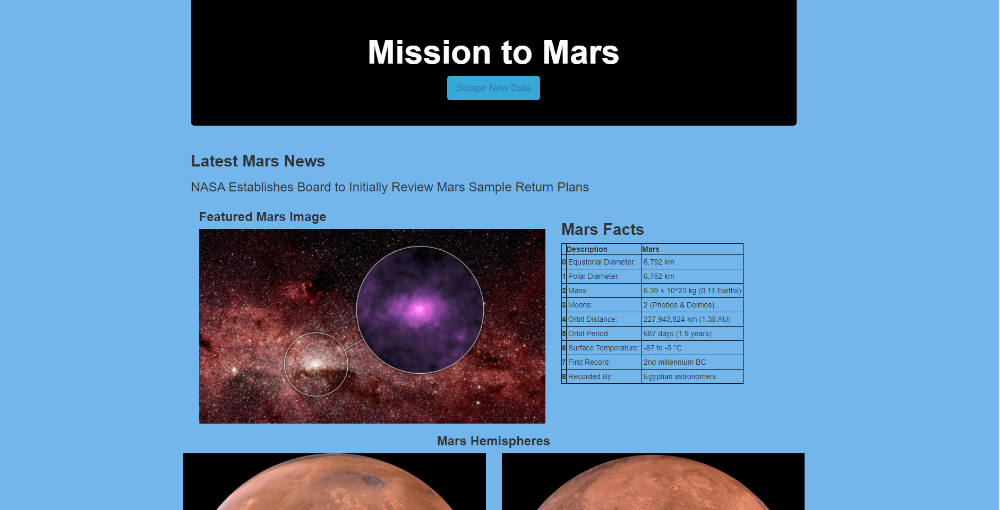

# Web Scraping Mars

The purpose of this assignment was to demonstrate web scraping using Python and storing the scraped data in a non-relational database, MongoDB.

Beautiful Soup was used to scrape and parse out specific data from NASA Mars News Website included the latest News Title and Paragraph Text,
JPL Mars Space Images and Featured Image.

Other technologies used included Pandas, Flask Pymongo, Jupyter Notebook and Chromedriver.

